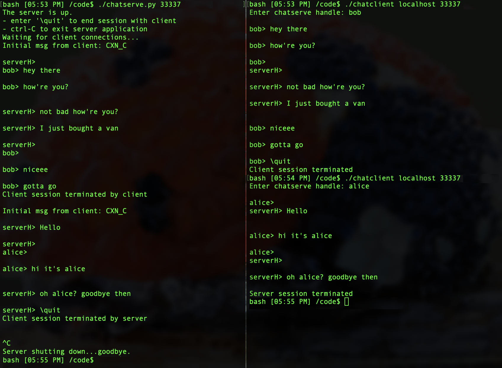

#  Chat Application

###### Chat client and server use sockets to send messages asynchronously using multi-threaded architecture.

A connection is established over the sockets API. The multithreaded design allows client and server to send messages in any order. After the client or server ends the session the server keeps it's socket open and waits for new connections. The program is currently hardcoded to connect on 'localhost' only.

## Requirements

- gcc compiler
- POSIX compliant OS
- python v3.9.5 or higher

## Usage

Compile chat client: `make`

1. Start the chat server first in it's own terminal

  `./chatserver.py localhost <port number>`   

  e.g. `./chatserver.py localhost 33337`

2. Sart the chat client in a separate terminal

  `./chatclient localhost <port number>`

  e.g. `./chatclient localhost 33337`

3. Client chooses a handle and the chat session begins. Messages sent in any order between client and server up to 500 characters per message.

4. Client or server can quit the session
  Client or server enters `\quit` to stop session.

5. Once session is over the server can accept a new connection from another client on the same port

6. Close server application with `ctrl-C`

##### Known issue:
The chat spacing is irregular because of blocking calls to get input from stdin using input() in chatserver.py and getline() in chatclient.c. Haven't found a way to reset the blocking call if the other thread receives data and prints it to the screen (therefore printing text where you're supposed to input your own message) without using a non-blocking function call to read data from stdin. The function poll() might work in C. Ideally, this i/o conflict would be resolved by creating separate regions on a GUI where data is input and data is displayed like a normal chat application. However, on a terminal this isn't possible to my knowledge.

## Output

